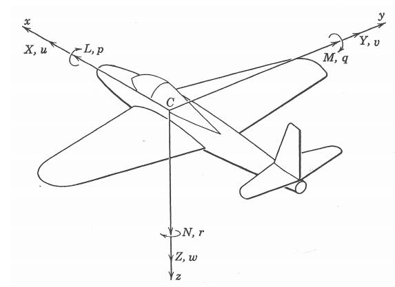
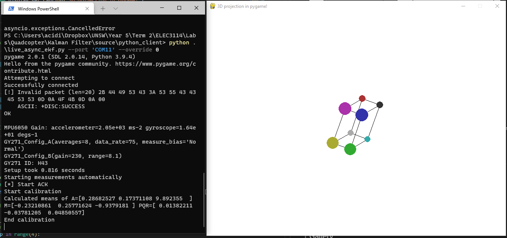

## Hardware 
Uses the MPU6050 combined gyroscope and accelerometer and GY271 compass as sensors. 
This communicates over Bluetooth to a python client which passes it to an extended Kalman filter for orientation estimation.

## State space model
A state space model can be described with the following equations.

Where x is our state, u is our input, A the state transition matrix, B the input matrix. Our measurements depend on the current state, and are given by y, where C is our output matrix, D is our feedforward matrix.

Our coordinate system of choice is given in the following diagram. +x faces forward, +y faces right, and +z faces down, relative from the sensor suite. 

For our orientation estimation problem, we have 2 measurements which depend on the current orientation; the gravity vector (Axyz) and magnetic heading vector (Mxyz). 

Additionally we know how the orientation changes based on the gyroscope, which gives us body angular velocity values (pqr).

We can use the gyroscope to formulate our state transition function f(x,u). In addition our state "x" is given as a quaternion, which is more appropriate for orientation estimation. Euler angles in comparison suffer from gimbal lock at singularity conditions.

If we take our original accelerometer or magnetometer measurement at our original orientation, the measurement taken by the sensors after our orientation changes is given in the following equations. "v" represents our original external vector, and "b" represents the measured body vector after our orientation changes from q=[1 0 0 0] to q=[e0 e1 e2 e3].

Our measurements are the body relative acceleration and magnetic heading vectors.

## Extended Kalman Filter
The Kalman filter takes in a state transition function, which updates our state from X(k) to X(k+1). Using Euler integration, this is given as the following equation.

A regular Kalman filter works with a linear state space model. However as seen in our measurement equations, we cannot represent it as a linear system where y=Cx.

This can be resolved by using an extended Kalman filter as shown below, where we take the Jacobian of our state transition function F(x,u) and measurement function h(x,u) as our Ak and Hk matrices.

Here Qk is our process covariance (how noisy our state transition process is), and Rk is our measurement covariance (how noisy our measurements are). 
Pk is our state covariance (how uncertain our state is at time t=k). 

We could take Qk and Rk as constants, and P(0) as our initial state covariance (uncertainty of initial state estimate). However as discussed [here](https://ahrs.readthedocs.io/en/latest/filters/ekf.html), we can estimate our process noise at t=k using the following formula.

## Gallery
